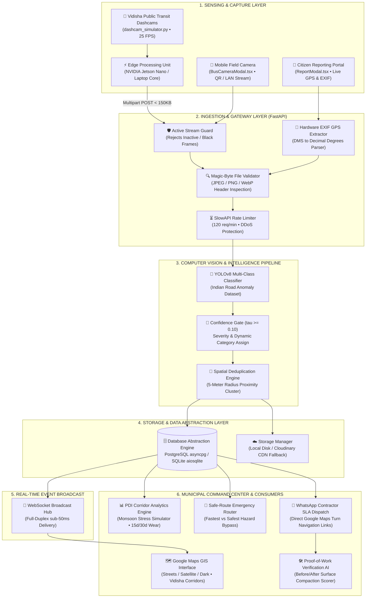
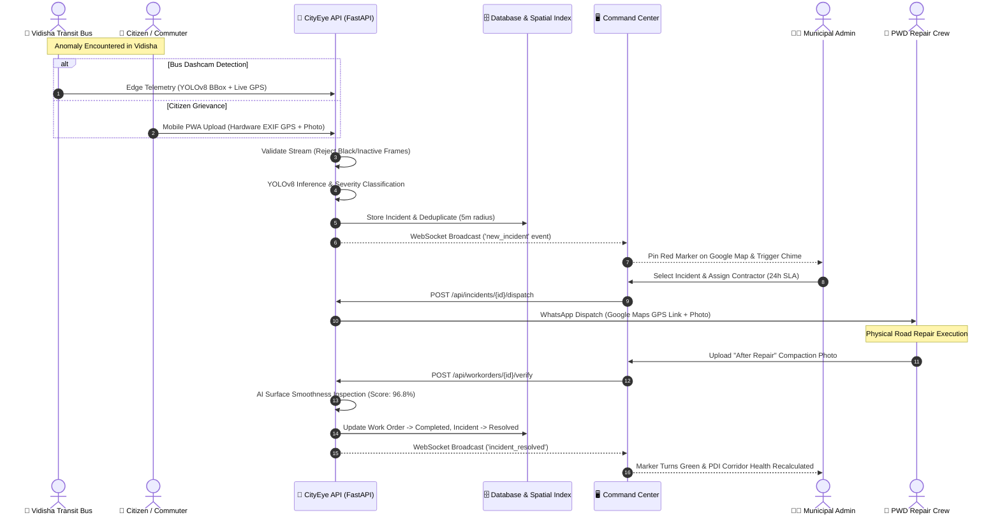
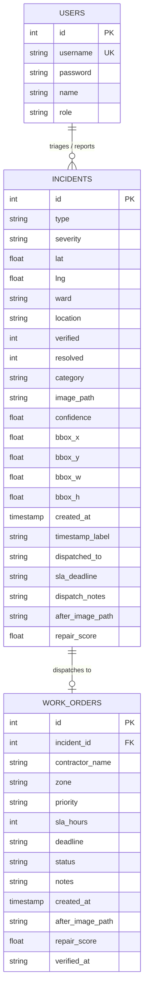
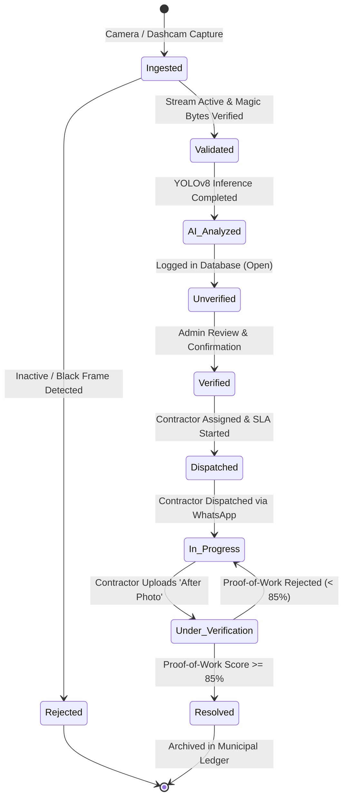

# CityEye — End-to-End System Architecture 🏗️

> **Smart India Hackathon (SIH) • Problem Statement 26124**  
> *Autonomous Road Hazard, Transit Fleet Sensing & Municipal Dispatch Platform*  
> *Municipal Deployment Focus: **Vidisha, Madhya Pradesh** (`23.5230° N, 77.8120° E`)*

---

## 🏛️ High-Level System Architecture

---

## 🔄 End-to-End Operational Lifecycle Sequence

---

## 🗂️ Database Entity Relationship Diagram (ERD)

---

## 🚦 Incident State Transition Diagram

---

## 🧩 Architectural Component Breakdown

| Layer | Technology | Primary Role |
|---|---|---|
| **Edge Hardware** | NVIDIA Jetson Nano / Raspberry Pi 4 / Laptop | Low-power on-bus neural inference running YOLOv8 at 25–30 FPS. |
| **Backend Core** | FastAPI (Python 3.12+), Uvicorn | High-throughput asynchronous REST & WebSocket ingestion. |
| **Database Abstraction** | PostgreSQL (`asyncpg`) / SQLite (`aiosqlite`) | Dual-mode resilience: cloud PostgreSQL for production, local SQLite for offline/demo zero-setup. |
| **Spatial Indexing** | Indexed B-Tree & Composite Coordinates | High-speed range queries across wards, severity levels, and contractor queues. |
| **GIS Mapping Engine** | React-Leaflet, Google Maps Tiles | Streets, Satellite Hybrid, and Dark GIS layers with Vidisha transit corridors. |
| **PDI Forecasting** | Time-series distress regression | Computes 0–100 Pavement Distress Index and 15d/30d wear forecasts per corridor. |
| **Routing Algorithm** | Anomaly-Weighted Dijkstra / Greedy Bypass | Bypasses severe potholes to generate smooth ambulance and commuter corridors. |
| **Field Dispatch** | WhatsApp URI Gateway & Webhook | Instant contractor dispatch with direct Google Maps turn navigation links. |
| **Security & Rate Limiter** | SlowAPI, JWT Bearer, bcrypt | 120 req/min general, 10 req/min auth brute-force protection. |
| **Client PWA** | Vite, TypeScript, Tailwind CSS, Service Worker | Offline-first Progressive Web App installable on mobile devices. |
