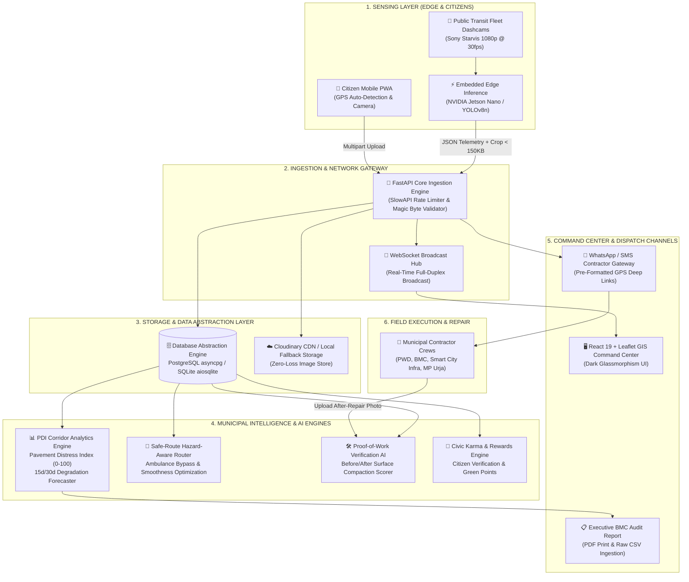
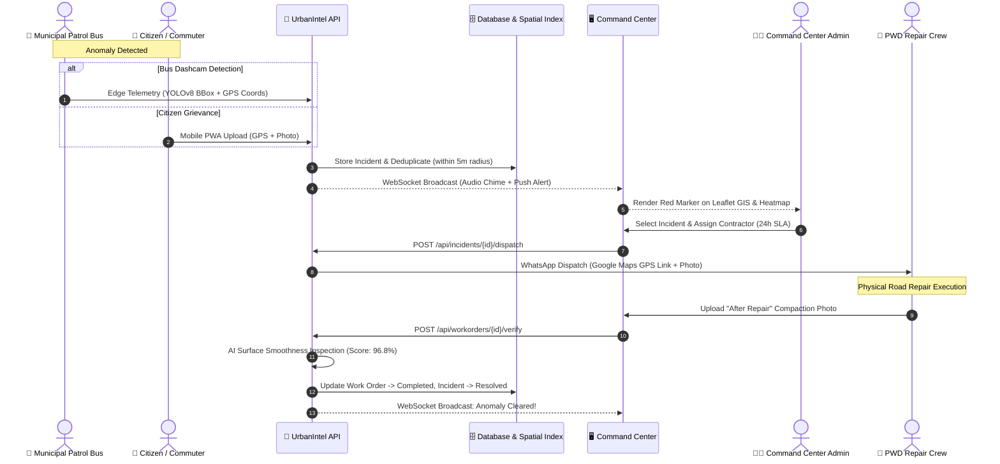

# UrbanIntel AI — End-to-End System Architecture 🏗️

> **Smart India Hackathon (SIH) • Problem Statement 26124**  
> *Autonomous Road Anomaly, Fleet Sensing & Municipal Dispatch Platform*

---

## 🏛️ High-Level System Architecture Diagram



---

## 🔄 End-to-End Operational Lifecycle



---

## 🧩 Architectural Component Breakdown

| Layer | Technology | Primary Role |
|---|---|---|
| **Edge Hardware** | NVIDIA Jetson Nano / Raspberry Pi 4 | Low-power on-bus neural inference running YOLOv8n at 30 FPS. |
| **Backend Core** | FastAPI (Python 3.13), Uvicorn | High-throughput asynchronous REST & WebSocket ingestion. |
| **Database Abstraction** | PostgreSQL (`asyncpg`) / SQLite (`aiosqlite`) | Dual-mode resilience: cloud PostgreSQL for production, local SQLite for offline/demo zero-setup. |
| **Spatial Indexing** | Indexed B-Tree & Composite Coordinates | High-speed range queries across wards, severity levels, and contractor queues. |
| **GIS Mapping Engine** | React-Leaflet, Leaflet.js, OpenStreetMap | Dynamic risk heatmaps, live animated bus patrol fleet markers, and hazard-aware polylines. |
| **PDI Forecasting** | Time-series distress regression | Computes 0–100 Pavement Distress Index and 15d/30d wear forecasts per corridor. |
| **Routing Algorithm** | Anomaly-Weighted Dijkstra / Greedy Bypass | Bypasses severe potholes to generate smooth ambulance and commuter corridors. |
| **Field Dispatch** | WhatsApp URI Gateway & Webhook | Instant contractor dispatch with direct Google Maps turn navigation links. |
| **Security & Rate Limiter** | SlowAPI, JWT Bearer, bcrypt | 10 req/min auth rate limiting, role-based access control (Admin vs Field Agent). |
| **Client PWA** | Vite, TypeScript, Tailwind CSS, Service Worker | Offline-first Progressive Web App installable on mobile devices. |
```
