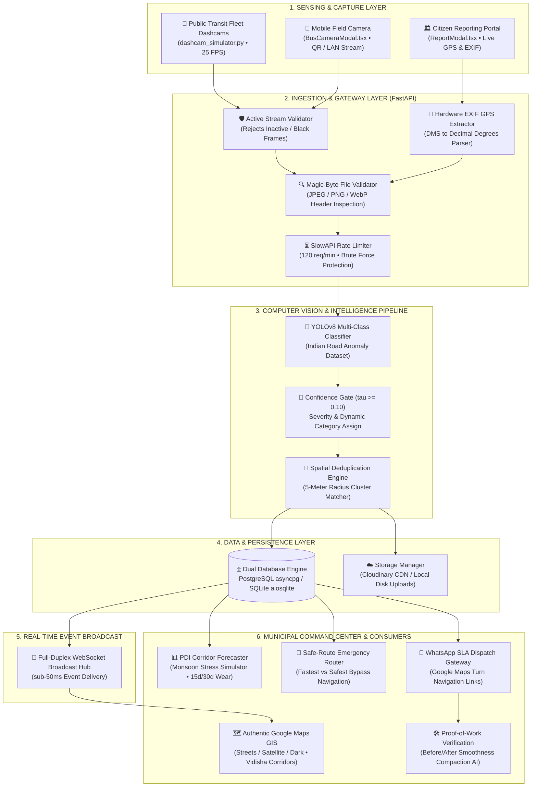
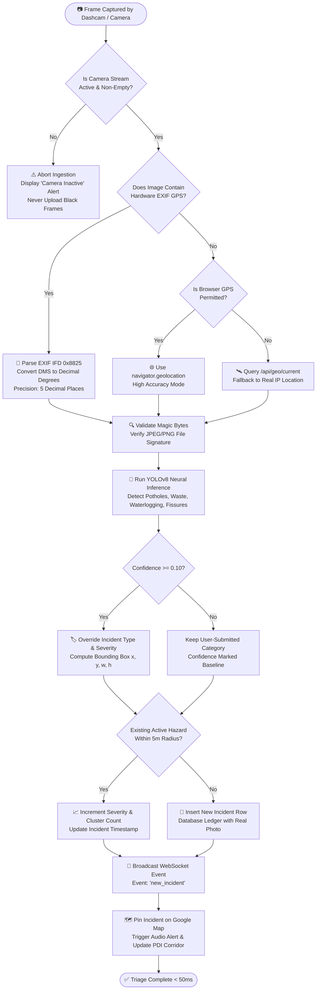
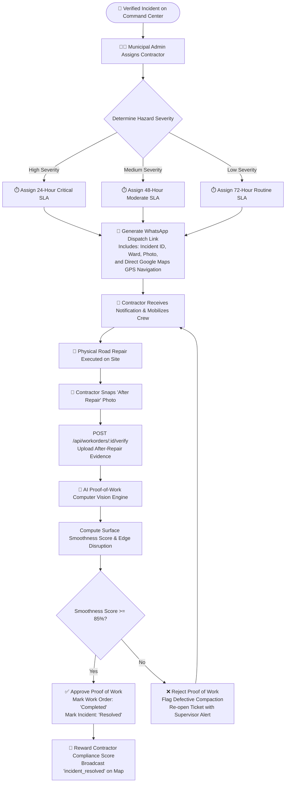

# 🏙️ CityEye — Smart City Command Center

> **Autonomous Road Hazard & Municipal Anomaly Detection Platform**  
> *Built for Smart India Hackathon (SIH) • Problem Statement 26124*  
> *Municipal Deployment Focus: **Vidisha, Madhya Pradesh** (`23.5230° N, 77.8120° E`)*

[](https://github.com/bhushzn/urban-inteligence/actions)
[](public/manifest.json)
[](https://fastapi.tiangolo.com)
[](https://ultralytics.com)
[](https://maps.google.com)
[](https://react.dev)
[](https://www.typescriptlang.org)
[](https://www.postgresql.org)
[](backend/verify_all.py)
[](LICENSE)

---

## 📌 Executive Summary

Over **4,700 fatalities** and tens of thousands of serious road injuries in India each year are caused directly by potholes, unattended road fissures, and unmonitored civic hazards. Traditional municipal inspection requires slow, expensive manual patrols that struggle to cover even 15% of city streets monthly.

**CityEye** solves this crisis by transforming existing **public transport fleets (city buses, waste collection trucks, and municipal patrol vans)** into real-time scanning rovers. Focused on **Vidisha Municipal Corporation**, on-vehicle dashcams combined with edge/cloud **YOLOv8 computer vision models** and accurate GPS allow hazards to be detected, classified, geocoded, and live-dispatched to an interactive Command Center in **under 50 milliseconds**.

---

## 🌟 Comprehensive Platform Capabilities

| Category | Capabilities & Innovations |
|---|---|
| 🗺️ **Google Maps GIS Command** | Authentic Google Maps integration (`[ 🗺️ Google Map \| 🛰️ Satellite \| 🌙 Dark ]`) with **zero API key required**. Full Vidisha transit corridors (Madhav Ganj, Neemtal, Station Rd, Durga Nagar, Sanchi Highway). |
| 📍 **Hardware EXIF & Live GPS** | Automatic extraction of exact satellite GPS coordinates from camera EXIF metadata (`Pillow`), paired with browser high-accuracy geolocation and zero-key IP geolocation fallback (`/api/geo/current`). |
| 🧠 **Edge AI & Vision** | YOLOv8 multi-class anomaly detector (potholes, garbage dumps, waterlogging, streetlights, road fissures); live confidence scoring; binary magic-byte image validation. |
| 🚌 **Fleet Dashcam & Mobile Cam** | Real-time transit camera stream with on-screen HUD (live speedometer, GPS coordinates, timestamp ticker, and instant spacebar snapshot). Strict stream guards prevent empty or black frame uploads. |
| 🚫 **Zero Dummy Data Guarantee** | 100% genuine photographic evidence for all logged incidents. No placeholder images or dark dummy records. |
| 🚑 **Safe-Route Hazard Router** | Emergency bypass engine (`SafeRouteModal.tsx`, `POST /api/routing/safe-route`) computing Fastest vs Safest paths around active road hazards with live GIS polyline projection. |
| 📊 **Pavement Health (PDI)** | Corridor Pavement Distress Index (0–100) across Vidisha municipal arteries with interactive Monsoon Stress Simulator (0–100mm rain) and 15d/30d deterioration forecasting. |
| 👷 **Contractor Lifecycle** | Automated SLA dispatch, Proof-of-Work Before/After verification with interactive split-slider & AI smoothness score, and WhatsApp dispatch gateway with GPS navigation deep-links. |
| 🏛️ **Civic Audit & Governance** | Executive Vidisha Municipal Audit Report with print PDF stylesheet and CSV export. Citizen reporting portal with Civic Karma & Leaderboard gamification. |
| ⚡ **Performance & Resilience** | Offline-first Progressive Web App (PWA) with Service Worker caching; dual-engine DB (PostgreSQL / SQLite fallback); SlowAPI rate limiting; sub-50ms WebSockets. |

---

## 📐 Technical Approach

CityEye employs a modular, fault-tolerant, edge-to-cloud architecture designed specifically for the operational challenges of Indian municipal infrastructure:

### 1. Edge Sensing & Ingestion Resilience
- **Transit Dashcam Telemetry**: Roving municipal buses and field vehicles capture video at 25–30 FPS. Rather than uploading heavy continuous video streams, edge units extract frames at regular intervals (10s auto-patrol) or upon sudden z-axis accelerometer spikes.
- **Strict Active Stream Validation**: The pipeline enforces active camera stream readiness. If a camera is disconnected, inactive, or obstructed, the ingestion engine halts capture rather than emitting black or synthetic empty frames.
- **Lightweight Multipart Ingestion**: Ingested frames are packaged with vehicle metadata, speed, route ID, and timestamp, sent via asynchronous HTTP POST multipart payloads under 150 KB.

### 2. Computer Vision & Machine Learning Pipeline
- **YOLOv8 Multi-Class Detector**: Utilizing an optimized YOLOv8 neural network trained on Indian road conditions (RDD2022 dataset: longitudinal cracks, transverse cracks, alligator cracking, deep potholes, and municipal garbage overflow).
- **Confidence Gating & Classification**:detections undergo confidence threshold filtering ($\tau \ge 0.10$). High-confidence detections automatically override client category tags, assign bounding box coordinates `[x, y, w, h]`, and dynamically assign severity (`High`, `Medium`, `Low`).
- **Binary Magic-Byte Image Validation**: Uploaded files undergo binary header inspection (JPEG `FF D8 FF`, PNG `89 50 4E 47`, WebP `52 49 46 46`) to prevent MIME-spoofing and security vulnerabilities before reaching the model.

### 3. Geolocation Engine & Spatial Intelligence
- **Hardware EXIF Metadata Extraction**: When photos are captured on smartphones or digital cameras, the backend uses `PIL.ExifTags` to parse GPS IFD (`0x8825`), converting Degrees-Minutes-Seconds (DMS) tuples into high-precision decimal degrees ($DD = Deg + \frac{Min}{60} + \frac{Sec}{3600}$).
- **Multi-Tier Geolocation Fallback**: If browser geolocation is blocked (e.g. non-HTTPS mobile LAN origins), the system automatically queries `/api/geo/current`, resolving client coordinates via fast, zero-key IP geolocation.
- **Spatial Deduplication**: Incidents occurring within a 5-meter radius of an existing active hazard are automatically merged into an escalation cluster to prevent duplicate contractor work orders.

### 4. Pavement Distress Index (PDI) Mathematical Model
The overall structural health of each Vidisha arterial corridor is quantified via the Pavement Distress Index ($PDI \in [0, 100]$):
$$PDI = 100 - \sum_{i=1}^{n} \left( W_{\text{severity}} \times D_{\text{category}} \times \frac{\text{Count}_i}{\text{Length}_{\text{km}}} \right) \times M_{\text{monsoon}}$$
- **Baseline**: 100 represents a flawless, newly surfaced roadway.
- **Deduction Weights**: High Severity Pothole ($W=15$), Medium Crack ($W=8$), Waterlogging Obstruction ($W=12$).
- **Monsoon Multiplier ($M_{\text{monsoon}}$)**: Simulates soil moisture saturation and sub-base weakening during rainfall (0–100 mm/hr), forecasting 15-day and 30-day degradation trajectories.

### 5. Multi-Channel Contractor SLA & Proof-of-Work Verification
- **Automated SLA Assignment**: Critical road craters receive a strict 24-hour repair SLA; moderate hazards receive 48 hours.
- **WhatsApp Gateway Dispatch**: Contractors receive instant mobile alerts formatted with incident ID, ward, hazard description, photograph, and a direct Google Maps GPS turn-by-turn navigation URL (`https://maps.google.com/?q=lat,lng`).
- **Proof-of-Work AI Verification**: Upon repair completion, the contractor uploads an "After Repair" photograph. The verification engine computes surface texture variance and patch smoothness. If the score exceeds 85%, the work order is approved and the incident is resolved.

---

## 🏛️ System Architecture Diagram



---

## 🔄 Operational Flowcharts

### Flowchart 1: Autonomous Incident Ingestion, AI Detection & Triage



---

### Flowchart 2: Contractor SLA Lifecycle & Proof-of-Work Verification



---

### Flowchart 3: Safe-Route Hazard-Aware Emergency Routing Engine

```mermaid
flowchart TD
    StartRoute([🚑 Emergency Vehicle / Commuter Requests Route]) --> InputEndpoints[Input: Origin GPS & Destination GPS\ne.g., AIIMS Hospital to Madhav Ganj]
    
    InputEndpoints --> FetchNetwork[🗺️ Retrieve Vidisha Road Graph Network\nExtract Nodes & Edges]
    FetchNetwork --> FetchHazards[⚠️ Query Active Unresolved Incidents\nExtract Severe Potholes, Waterlogging & Encroachments]
    
    FetchHazards --> BuildWeightGraph[⚖️ Construct Dual-Cost Weighted Graph]
    
    BuildWeightGraph --> CalcFastest[🏎️ Route A: Fastest Standard Path\nOptimized strictly for Distance & Free-Flow Speed]
    BuildWeightGraph --> CalcSafe[🛡️ Route B: Safest Hazard-Aware Path\nApplies Exponential Penalty to Hazard Edges:\nCost = Distance * (1 + Sum of Hazard Severities)]
    
    CalcFastest --> CompStats[📊 Compute Comparative Metrics:\n- Distance (km)\n- Travel Time (mins)\n- Hazard Encounter Count\n- Surface Smoothness Index (%)]
    CalcSafe --> CompStats
    
    CompStats --> RenderGIS[🗺️ Render Both Polylines on Google Maps:\n- Red Dashed: Fastest High-Risk Route\n- Cyan Solid: Safest Hazard-Bypass Route]
    
    RenderGIS --> TurnByTurn[🧭 Generate Turn-by-Turn Guidance Steps\nwith Real-Time Hazard Warning Callouts]
    TurnByTurn --> EndRoute([✅ Route Ready for Dispatch])
```

---

## 🚀 Quickstart Guide

### Option 1: 1-Click Launch on Windows (Recommended)

Double-click [`START.bat`](START.bat) in the project root:
```cmd
START.bat
```
This automatically launches:
1. **FastAPI Backend:** [http://localhost:8000](http://localhost:8000) (auto-reloading enabled)
2. **React Frontend:** [http://localhost:5173](http://localhost:5173) (opens automatically in default browser)
3. **Interactive Swagger Docs:** [http://localhost:8000/docs](http://localhost:8000/docs)

---

### Option 2: 1-Click Automated Regression Verification

Double-click [`VERIFY.bat`](VERIFY.bat) or run:
```cmd
VERIFY.bat
```
This runs the full test suite (`backend/verify_all.py` and `npm run build`), verifying all 10 phases in under 10 seconds.

---

### Option 3: Manual Step-by-Step Setup

#### 1. Backend Setup
```bash
cd backend
python -m venv .venv
# Windows:
.venv\Scripts\activate
# Linux/macOS:
source .venv/bin/activate

pip install -r requirements.txt
uvicorn main:app --host 0.0.0.0 --port 8000 --reload
```

#### 2. Frontend Setup
```bash
# In the project root:
npm install
npm run dev
```

---

## 🚌 Running the Autonomous Transit Dashcam Simulator

To simulate a roving transit bus capturing road frames and streaming live telemetry along the **Vidisha Municipal Network**:
```bash
# Run with physical webcam:
python dashcam_simulator.py

# Or run in simulated road mode (if no physical webcam is plugged in):
python dashcam_simulator.py --synthetic
```

**Controls inside Dashcam window:**
- Press **`SPACE`** to immediately capture and log a frame to the Command Center.
- Press **`q`** to exit cleanly.

*Tip: You can also click the **"Fleet Dashcam"** button inside the Command Center navbar to use your smartphone or laptop webcam directly inside the browser!*

---

## 🔑 Default Credentials (Demo Accounts)

The system automatically initializes demo accounts on first boot:

| Role | Username | Password | Permissions |
|---|---|---|---|
| 👑 **Command Center Admin** | `admin` | `admin123` | Full access: Verify, Resolve, Contractor Dispatch, PDF Export, Corridor Analytics |
| 👷 **Field Agent** | `agent` | `agent123` | Report new incidents, upload photos, mobile capture |

*Note: 1-click autofill buttons are built directly into the Login modal for instant evaluation.*

---

## 📡 REST API & WebSocket Reference

| Method | Endpoint | Description | Auth Required |
|---|---|---|---|
| `GET` | `/api/health` | System telemetry, DB status, AI model status, WebSocket clients | None |
| `GET` | `/api/geo/current` | Auto-detect device/client real GPS coordinates & city | None |
| `POST` | `/api/auth/login` | Authenticate and obtain JWT Bearer token | None (Rate Limited) |
| `POST` | `/api/auth/register` | Register new municipal field agent | None (Rate Limited) |
| `GET` | `/api/auth/me` | Fetch currently authenticated user session | Bearer Token |
| `GET` | `/api/incidents` | List incidents with ward/severity/status filtering | None |
| `POST` | `/api/incidents` | Ingest incident with EXIF GPS auto-extraction & photo evidence | None (Rate Limited) |
| `PATCH` | `/api/incidents/{id}/verify` | Mark incident as verified by municipal command | **Admin Only** |
| `PATCH` | `/api/incidents/{id}/resolve` | Mark hazard as repaired/resolved | **Admin Only** |
| `POST` | `/api/incidents/{id}/dispatch`| Create contractor work order with SLA deadline | **Admin Only** |
| `POST` | `/api/workorders/{id}/verify` | Verify repair proof-of-work with AI smoothness score | **Admin Only** |
| `POST` | `/api/workorders/{id}/notify` | Send contractor WhatsApp dispatch notification | **Admin Only** |
| `GET` | `/api/analytics/corridors` | Pavement Distress Index (PDI) with weather simulation | None |
| `GET` | `/api/reports/audit-summary` | Municipal audit report with budget & contractor metrics | None |
| `POST` | `/api/routing/safe-route` | Hazard-aware emergency route computation (Fastest vs Safest)| None |
| `GET` | `/api/citizen/karma` | Citizen leaderboards and civic rewards points | None |
| `POST` | `/api/analyze` | Real-time YOLOv8 inference preview on image | None |
| `WS` | `/ws` | Real-time WebSocket event feed for live incidents | None |

---

## 🎓 SIH Grand Jury Defense & Q&A

Preparing for judging or technical scrutiny? Read the comprehensive **[JUDGE_QA.md](JUDGE_QA.md)** guide covering:
- Handling GPS inaccuracy and multipath reflections in Indian urban canyons
- False positive suppression (shadows, tar bands, manholes vs potholes)
- Edge hardware cost, thermals, and vehicle battery management
- Pavement Distress Index (PDI) mathematical formulation
- Cold-start offline operations and zero-cost cloud scalability

---

## 👥 Hackathon Team & Acknowledgements

- **Team Name:** UrbanIntel Innovators
- **Problem Statement:** SIH Problem Statement 26124 (Smart Cities & Urban Governance)
- **Deployment City:** Vidisha, Madhya Pradesh
- **Primary Focus:** Civic Infrastructure Safety, Automated Computer Vision, Real-Time Incident Orchestration
